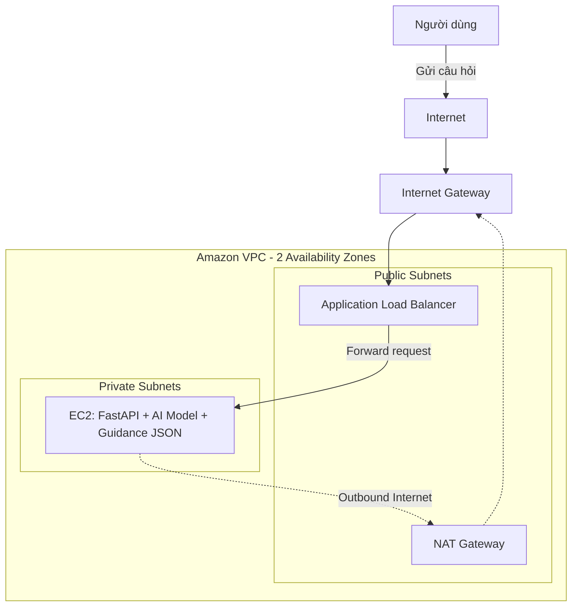

# Phần 2: Đăng ký ý tưởng sản phẩm – Banking Intent API

## 1. Tên dự án và mục tiêu sản phẩm

- **Tên dự án:** Banking Intent API
- **Mục tiêu sản phẩm:** Banking Intent API là một sản phẩm sử dụng Machine Learning để phân tích câu hỏi tự nhiên của người dùng, nhận diện nhu cầu hỗ trợ và cung cấp hướng dẫn ban đầu tương ứng. Dự án mô phỏng bài toán chăm sóc khách hàng trong môi trường ngân hàng số.

## 2. Công nghệ sử dụng

- **Programming Language:** Python
- **Framework:** FastAPI
- **Machine Learning:** Scikit-learn, sử dụng TF-IDF để biểu diễn văn bản và Logistic Regression để phân loại intent
- **Data Storage:** CSV lưu dữ liệu huấn luyện, JSON lưu nội dung hướng dẫn; chưa sử dụng database
- **Version Control:** Git và GitHub

## 3. Cách ứng dụng tương tác với hạ tầng VPC

Banking Intent API được triển khai trong Amazon VPC gồm các Public Subnet và Private Subnet trải trên hai Availability Zones.

Application Load Balancer và NAT Gateway được đặt trong Public Subnet. Load Balancer tiếp nhận request từ Internet và chuyển tiếp request qua mạng nội bộ VPC đến EC2 trong Private Subnet.

EC2 chạy FastAPI, mô hình Machine Learning đã được huấn luyện và file JSON chứa nội dung hướng dẫn. EC2 không có Public IP và chỉ nhận traffic từ Load Balancer.

Khi EC2 cần tải thư viện, cập nhật hệ thống hoặc kết nối đến dịch vụ bên ngoài, traffic outbound được định tuyến qua NAT Gateway trước khi đi ra Internet Gateway.

### Sơ đồ kiến trúc



### Luồng xử lý request

1. Người dùng gửi câu hỏi đến địa chỉ public của Application Load Balancer.
2. Request đi qua Internet Gateway và được định tuyến đến Load Balancer trong Public Subnet.
3. Load Balancer chuyển request qua mạng nội bộ VPC đến EC2 trong Private Subnet.
4. FastAPI tiếp nhận câu hỏi và gửi nội dung đến mô hình Machine Learning.
5. Mô hình dự đoán intent của người dùng.
6. Ứng dụng lấy hướng dẫn tương ứng từ file JSON.
7. FastAPI trả kết quả về cho người dùng thông qua Load Balancer.

Luồng xử lý chính:

```text
Người dùng
→ Internet Gateway
→ Application Load Balancer
→ EC2/FastAPI
→ AI Model
→ Hướng dẫn
→ Application Load Balancer
→ Người dùng
```

### Định tuyến mạng

Route Table của Public Subnet có đường đi trực tiếp đến Internet Gateway:

```text
0.0.0.0/0 → Internet Gateway
```

Route Table của Private Subnet không có đường đi trực tiếp đến Internet Gateway. Khi EC2 cần chủ động truy cập Internet, traffic outbound được chuyển qua NAT Gateway:

```text
EC2 trong Private Subnet
→ NAT Gateway trong Public Subnet
→ Internet Gateway
→ Internet
```

### Bảo mật

- Network ACL kiểm soát traffic ở cấp subnet và hoạt động theo cơ chế stateless.
- Security Group của Load Balancer cho phép HTTP/HTTPS từ Internet.
- Security Group của EC2 chỉ cho phép traffic trên cổng chạy FastAPI từ Security Group của Load Balancer.
- EC2 không có Public IP và không nhận kết nối trực tiếp từ Internet.
- NAT Gateway chỉ hỗ trợ kết nối outbound từ Private Subnet; Internet không thể chủ động kết nối vào EC2 thông qua NAT Gateway.
- Security Group hoạt động theo cơ chế stateful nên traffic phản hồi của kết nối hợp lệ được tự động cho phép.

Kiến trúc này tách điểm truy cập công khai khỏi máy chủ ứng dụng, giúp giảm bề mặt tấn công và bảo vệ FastAPI cùng mô hình Machine Learning trong Private Subnet.